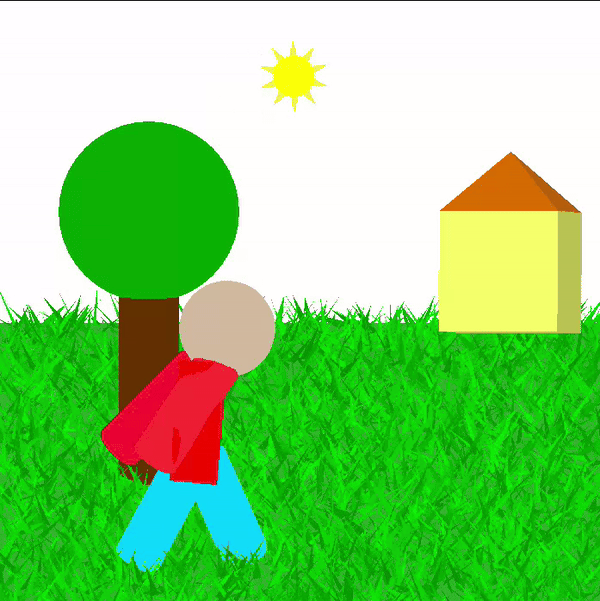
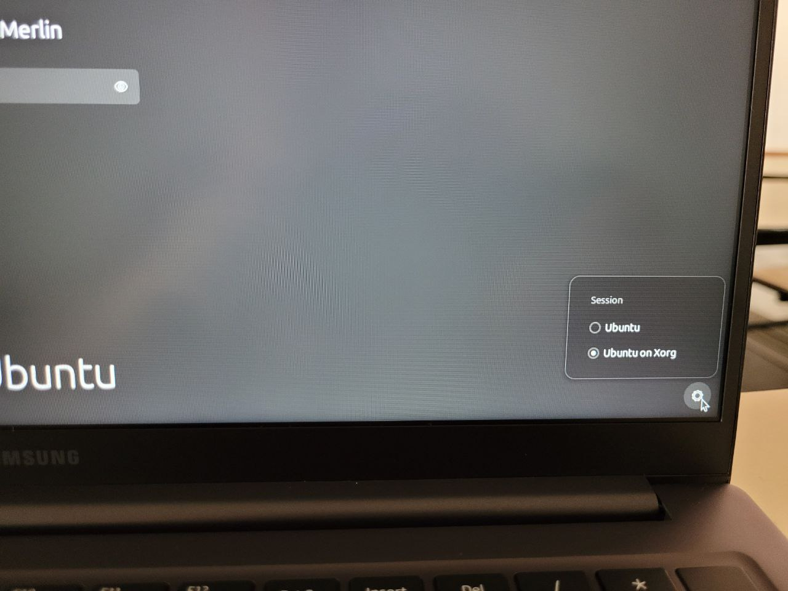
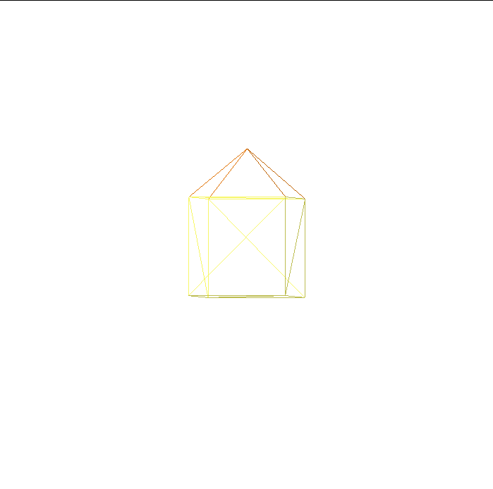
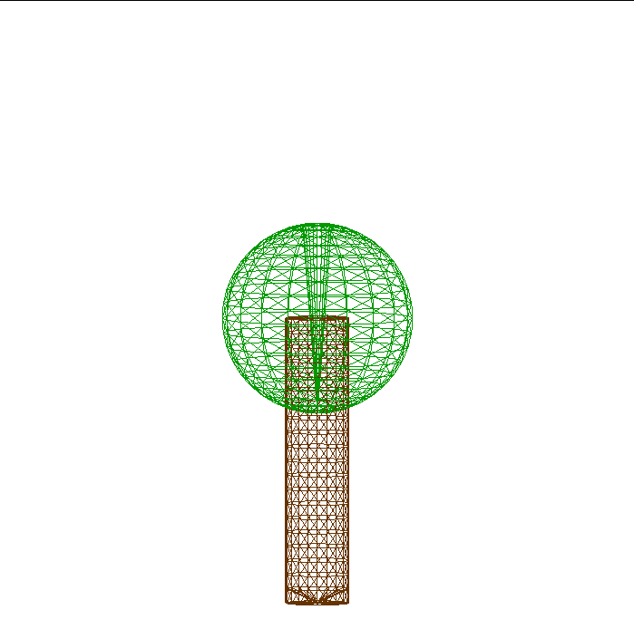
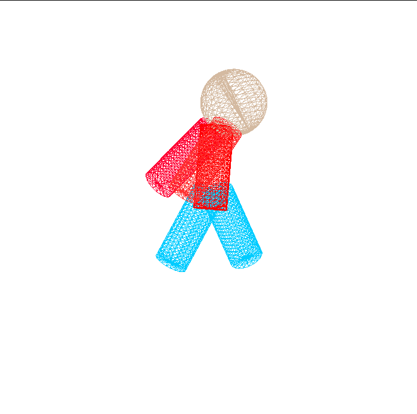
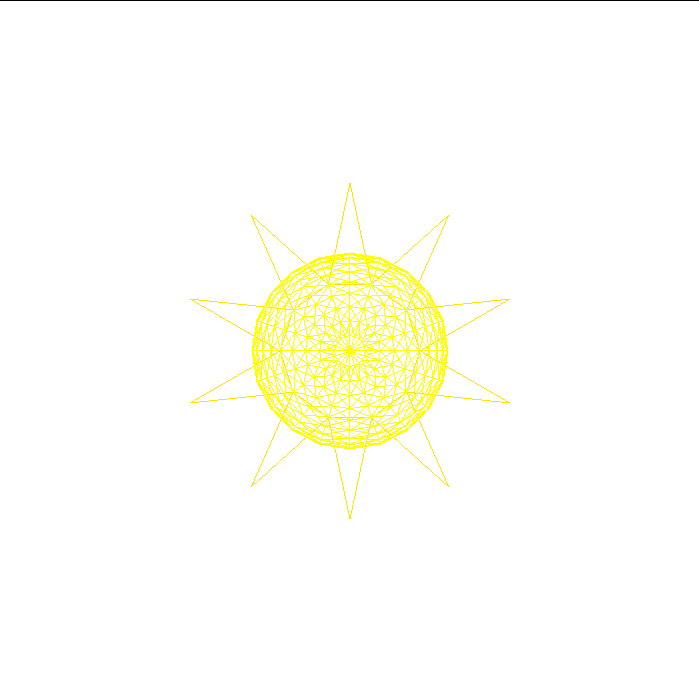
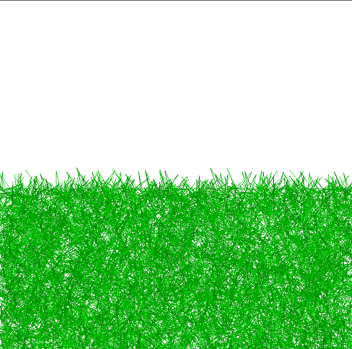
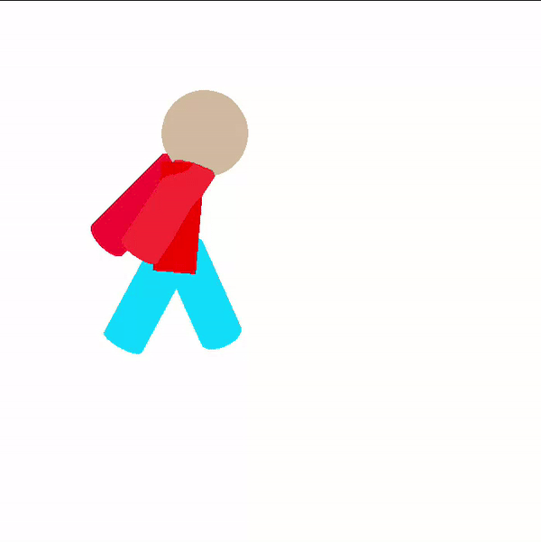
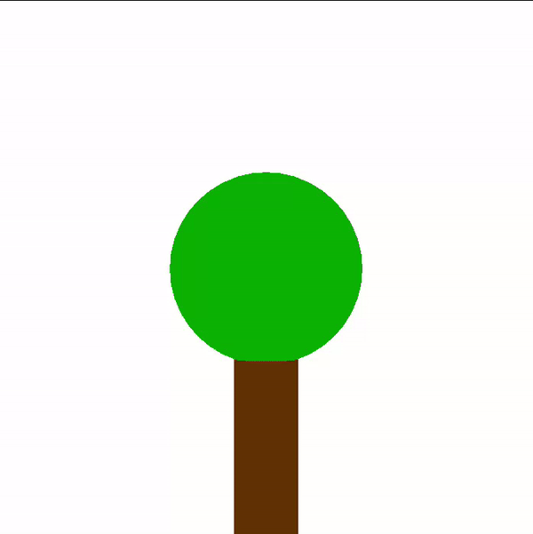

# Computer Graphics 3D scene

## Index

- [Computer Graphics 3D scene](#computer-graphics-3d-scene)
  - [Index](#index)
  - [Introduction](#introduction)
  - [How to run](#how-to-run)
    - [Prerequisites](#prerequisites)
      - [Miniconda](#miniconda)
      - [Libraries](#libraries)
      - [Graphic display](#graphic-display)
    - [Main code](#main-code)
  - [Files](#files)
  - [Objects](#objects)
  - [Transformations](#transformations)
  - [Conclusion](#conclusion)

## Introduction

This project was done as part of the Computer Graphics discipline taught in the second semester of 2024 by the professor Jean Roberto Ponciano. The code was produced by the duo composed by Artur de Vlieger Lima and Gabriel da Costa Merlin.

In this code, a 3D scene was implemented using some graphic tools, such as GLFW to manage windows and OpenGL to handle the graphic computing. Our main goal was to create a landscape using 5 composed objects (combination of primitives - pyramid, cube, sphere, etc) and to move some of them using the keyboard to add geometric transformations.



## How to run

### Prerequisites

Here is described what you must do to have everything needed to run this code.

#### Miniconda

The use of miniconda is recommended in order to prevent already installed packages from having conflicts with the ones we will install.

1. Download Miniconda installer:

```bash
wget https://repo.anaconda.com/miniconda/Miniconda3-latest-Linux-x86_64.sh
```

2. Run the installer:

```bash
bash Miniconda3-latest-Linux-x86_64.sh
```

3. Create a new environment:

```bash
conda create -n myenv python=3.9
```

4. Activate this environment:

```bash
conda activate myenv
```

#### Libraries

Within your Miniconda environment, install the packages used in the project.

1. Install NumPy:

```bash
pip install numpy==2.0.1
```

2. Install GLFW:

```bash
pip install glfw==2.7.0
```

3. Install OpenGL:

```bash
pip install pyopengl==3.1.7
```

#### Graphic display

One of the members of the duo had trouble running OpenGL on [Wayland](https://wiki.archlinux.org/title/Wayland) display server, but the same code worked just by switching the server to [Xorg](https://wiki.archlinux.org/title/Xorg). So, if this code doesn't work properly on your machine, try changing the display server to Xorg.

Below there is a photo of a Ubuntu 24.04 login screen while switching the display servers.



### Main code

We used several files in order to modularize our code, so we needed a main file to be able to run the project. To run it, you just need to type:

```bash
python3 main.py
```

## Files

As said above we used a bunch of files while modularizing the code. More specifically, we created 7 different files:

- main.py: The hub used to connect all the other files.
- config_screen.py: Contains functions that are used to configure the screen that is used to show the drawings.
- geometric_transf.py: Returns all kind of geometric transformations matrixes (translation, rotation and scale) in the appropriate numpy shape.
- keyboard.py: Handles the user interaction through keyboard.
- shapes.py: Recycled code from our professor (Jean Roberto Ponciano) used to create more complex shapes, such as spheres and cylinders.
- vertexes.py: Creates in CPU all the needed vertexes of our objects.
- drawings.py: Draws and paints the final scene objects, in addition to apply geometric transformations to them.

## Objects

We used five different objects to compose our desired 3D scene, being them:

**OBS**: All the pictures below were got after pressing the P key to show objects' mesh.

- House: created by placing a pyramid above a cube - **3D object**.



- Tree: generated by putting a sphere above a cylinder - **3D object**.



- Person: drawed by putting in the right position 5 different cylinders (legs, arms and torso) and a sphere (head) - **3D object**.



- Sun: created by using a sphere and some triangles.



- Ground: generated by using a single plane and various ramdom placed triangles, which create a grass visual in our scene.



## Transformations

The user is able to control the scene by forcing 3 different geometric transformations:

- Translation: The person can be moved by pressing the ← or → keys on the keyboard.



- Rotation: The sun starts rotatating if the A or S keys are pressed.


- Scale: The tree resizes by pressing the ↑ or ↓ keys.



## Conclusion

In this project, we put into practice different Computer Graphics concepts, such as shaders and geometric transformations, which helped us to solidify our studies.

Finally, we would like to thank our professor Jean Roberto Ponciano for the classes and the acquired knowledge.
